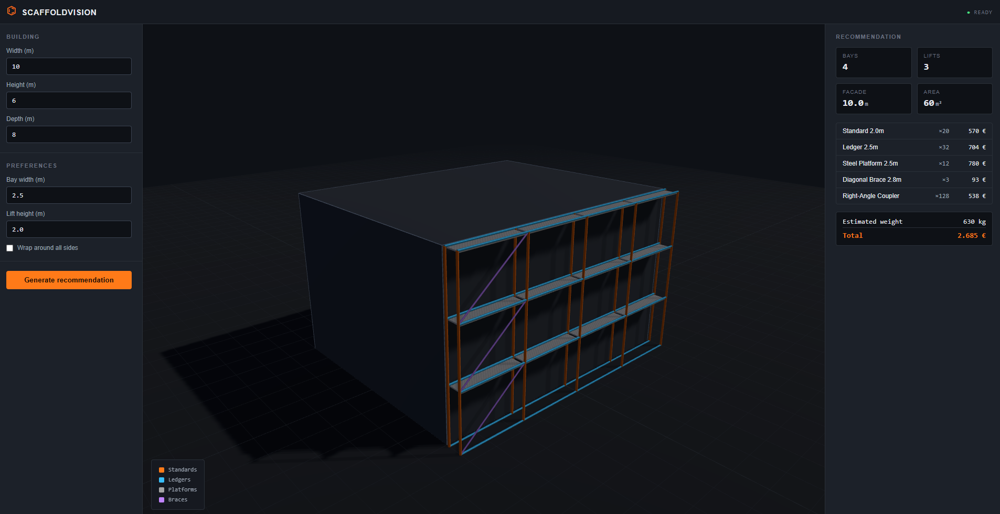
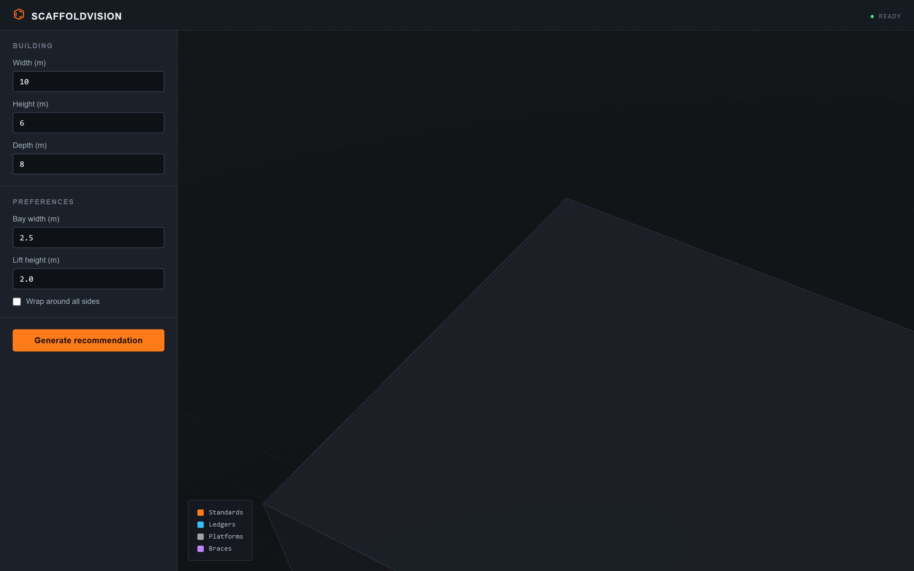
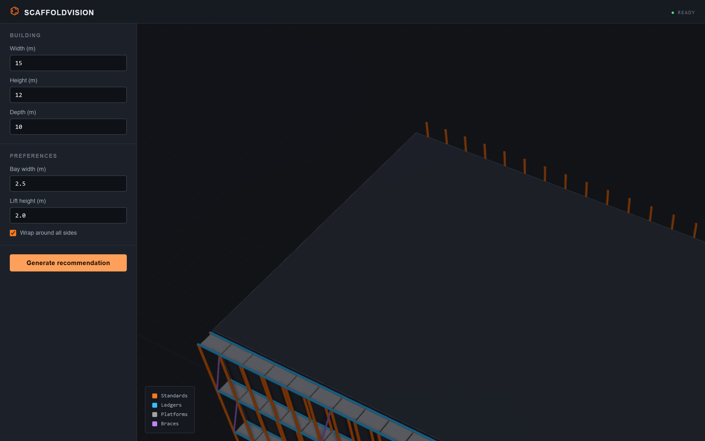

# ScaffoldVision

A 3D scaffolding configurator with a rule-based design assistant. Built to explore the technical challenges of digitalizing the scaffolding industry — from 3D visualization to algorithmic component recommendation.






## What It Does

ScaffoldVision visualises scaffold structures around buildings in an interactive 3D viewport. Enter the dimensions of a building and the system computes how many bays and lifts are needed, picks the best-fitting components from a catalog, calculates total cost and weight, and renders the resulting scaffold around the building in 3D.

The recommendation engine is deterministic and rule-based, mirroring how a planner thinks about scaffold layout: bay widths, lift heights, bracing intervals, and component selection. The architecture leaves room for a learned model to replace the rule-based core later — see [docs/ARCHITECTURE.md](docs/ARCHITECTURE.md).

### Generating a recommendation

Adjust the building dimensions on the left, click **Generate recommendation**, and the right panel populates with bay/lift counts, component line items, total cost, and total weight. The 3D scaffold renders around the building in real time.


### Engineering notes for non-trivial cases

For tall buildings or wraparound configurations, the recommender adds engineering notes — for example, anchoring requirements above 8m height, referencing DIN EN 12810 / 12811.



## Architecture

```
┌─────────────────────────────────────────────────────────────┐
│  Browser (TypeScript + Three.js)                            │
│  ┌──────────────┐  ┌──────────────┐  ┌─────────────────┐    │
│  │ 3D Viewport  │  │ Building     │  │ Recommendation  │    │
│  │ (Three.js)   │  │ Inputs       │  │ Panel           │    │
│  └──────────────┘  └──────────────┘  └─────────────────┘    │
└──────────────────────────┬──────────────────────────────────┘
                           │ REST / JSON
┌──────────────────────────▼──────────────────────────────────┐
│  ASP.NET Core 8 Web API                                     │
│  ┌──────────────┐  ┌──────────────┐  ┌─────────────────┐    │
│  │ Components   │  │ Configuration│  │ Recommendations │    │
│  │ Controller   │  │ Controller   │  │ Controller      │    │
│  └──────────────┘  └──────────────┘  └─────────────────┘    │
│         │                  │                   │            │
│  ┌──────▼──────────────────▼───────────────────▼────────┐   │
│  │ IComponentCatalog · IConfigurationService            │   │
│  │ IScaffoldRecommender (rule-based geometric solver)   │   │
│  └──────────────────────────────────────────────────────┘   │
└─────────────────────────────────────────────────────────────┘
```

See [docs/ARCHITECTURE.md](docs/ARCHITECTURE.md) for design decisions and trade-offs.

## Tech Stack

**Frontend:** TypeScript, Three.js, Vite — zero UI framework, kept deliberately small
**Backend:** C# / .NET 8, ASP.NET Core — zero external NuGet dependencies; runs on the framework reference alone
**Tests:** Console-app test runner with hand-rolled assertions — `dotnet run` executes the suite
**CI:** GitHub Actions building both projects and running the tests

The minimal-dependency choice is intentional. It means anyone can clone, build, and run the project without first sorting out package restores, compatible versions, or test runners. Production extensions (Postgres persistence, learned recommender) are described in the architecture document as the next steps rather than baked into the MVP.

## Features

- Interactive 3D scaffold viewport with orbit controls and shadows
- Live building preview that updates as dimensions change
- Recommendation engine that computes bay count, lift count, component quantities, total cost, and total weight
- Component catalog with seeded scaffold parts (standards, ledgers, platforms, braces, couplers)
- Notes flagging engineering considerations (anchoring, bracing intervals)
- Save / load / list configurations via REST
- Dark industrial UI with steel greys and structural orange accents

## Getting Started

### Prerequisites

- [.NET 8 SDK](https://dotnet.microsoft.com/download)
- [Node.js 20+](https://nodejs.org/)

### Run the backend

```bash
cd backend
dotnet run --project src/ScaffoldVision.Api
```

The API listens on `http://localhost:5000`.

### Run the frontend

In a second terminal:

```bash
cd frontend
npm install
npm run dev
```

Open `http://localhost:5173`. The Vite dev server proxies `/api/*` to the backend.

### Run the tests

```bash
cd backend/tests/ScaffoldVision.Tests
dotnet run
```

The test runner reports per-test pass/fail and exits non-zero on failure.

## API

The API exposes three resource groups. All requests and responses are JSON.

### `POST /api/recommendations`

Compute a scaffold for a given building and preferences.

```bash
curl -X POST http://localhost:5000/api/recommendations \
  -H 'Content-Type: application/json' \
  -d '{
    "building": { "widthMeters": 10, "heightMeters": 6, "depthMeters": 8 },
    "preferences": {
      "bayWidthMeters": 2.5,
      "liftHeightMeters": 2.0,
      "braceEveryNBays": 5,
      "wrapAround": false
    }
  }'
```

Returns a `RecommendationResponse` with summary geometry, component line items, total cost, total weight, and engineering notes.

### `GET /api/components`

List all components in the catalog. Supports `?category=Standard|Ledger|Platform|Brace|Connector`.

### `POST /api/configurations`, `GET /api/configurations[/{id}]`, `DELETE /api/configurations/{id}`

CRUD for saved configurations. Configurations are kept in-process for the MVP.

## Project Structure

```
scaffold-vision/
├── backend/
│   ├── src/ScaffoldVision.Api/
│   │   ├── AI/                 # Rule-based recommender
│   │   ├── Controllers/        # REST endpoints
│   │   ├── Models/             # Domain types
│   │   ├── Services/           # Catalog + configuration services
│   │   └── Program.cs          # DI wiring
│   └── tests/ScaffoldVision.Tests/
│       ├── Program.cs          # Test cases
│       └── TestRunner.cs       # Lightweight runner + assertions
├── frontend/
│   ├── src/
│   │   ├── viewport/           # Three.js scene
│   │   ├── components/         # UI rendering helpers
│   │   ├── api/                # Backend client
│   │   ├── domain/             # Shared types
│   │   ├── main.ts             # Entry point
│   │   └── styles.css          # Industrial theme
│   └── index.html
├── docs/ARCHITECTURE.md        # Design decisions
└── .github/workflows/ci.yml    # Build + test on push
```

## Roadmap

- [x] 3D viewport with orbit controls and lighting
- [x] Component palette with seeded catalog
- [x] Rule-based scaffold recommender with cost and weight estimates
- [x] Live scaffold rendering around the building
- [x] REST API with components, configurations, recommendations
- [x] Unit tests for the recommender geometry
- [x] CI pipeline
- [ ] Persist configurations to PostgreSQL
- [ ] Load-bearing constraint warnings (height vs. anchor density)
- [ ] Export to industry-standard formats (IFC)
- [ ] Replace the rule-based core with a learned recommender once labelled data exists

## Why This Project

Scaffolding is a domain where digitalization lags other construction subfields. This project explores how modern web technologies, 3D rendering, and applied algorithms can lower the barrier to scaffold planning — making it accessible without specialized CAD software.

Built as a learning project to deepen experience with full-stack architecture, 3D engines, and clean system design in an industrial context.

## License

MIT — see [LICENSE](LICENSE).
